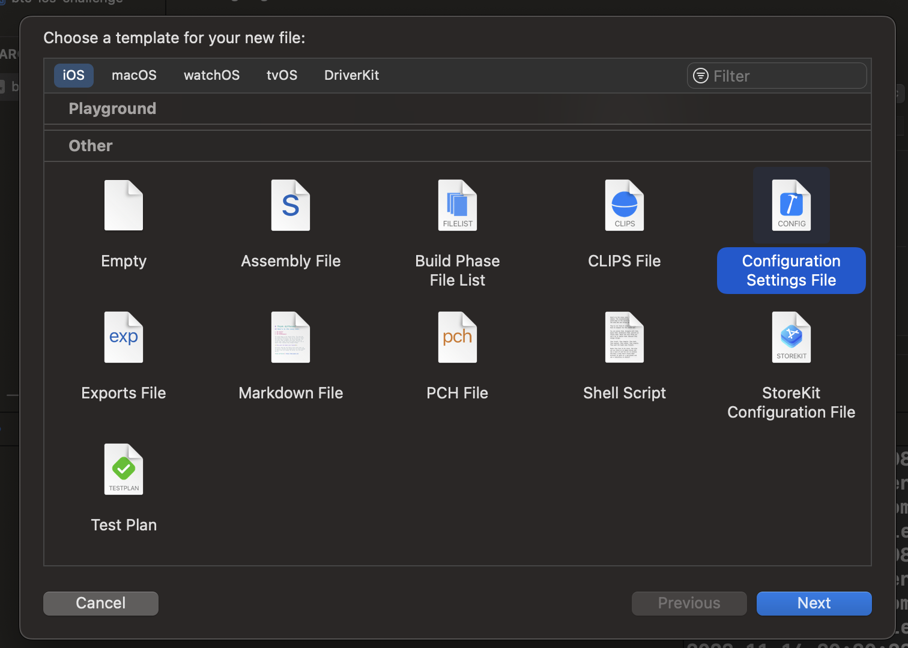

# WatchIt

> Minha tentativa de implementar o [desafio BTG](https://github.com/btgpactualdigitaldev/iOS-challenge-BTG#desafio-btg-ios) para dev iOS.

Um aplicativo simples, com persistência local utilizando Core Data, que consome a API do The Movie Database.

<p align="center">
    
</p>

## Features

- [x] Tab bar com dois ítens: Filmes e Favoritos, sendo a principal a tab de Filmes;

- A tela de Filmes deverá conter:
    - [x] Uma lista dos filmes populares da API;
    - [x] Cada elemento da lista deve conter o poster, o nome e o ano que o filme foi produzido;
    - [x] Ao clicar em um ítem, deve ser apresentada a tela de detalhes (tela descrita abaixo);
    - [ ] Search bar para pesquisar filmes por nome;

- A tela de favoritos deverá conter:
    - [x] A lista de favoritos persistidos no app entre sessões;
    - [ ] Search bar para pesquisar favoritos por nome e ano;
    - [x] Ao clicar em um ítem, deve ser apresentada a tela de detalhes (tela descrita abaixo);

- A tela de detalhes deve apresentar os seguintes dados do filme:
    - [x] Poster;
    - [x] Botão para favoritar/desfavoritar;
    - [x] Título;
    - [x] Sinopse;
    - [x] Nota do filme;
    - [x] E os gêneros por extenso.

> É necessário fazer tratamento de erros e dos fluxos de exceção, como busca vazia, carregando e outros erros que possam ocorrer.

## Compilado o Projeto

Para iniciar o projeto no simulador ou dispositivo, você irá precisar de uma chave para usar a API do TMDB. Para adicionar a chave ao projeto você precisa criar um arquivo de configuração na raiz do projeto chamado de `Secrets`:



Dentro do arquivo você adiciona a sua chave de API:
```Swift
//  Secrets.xcconfig

API_KEY = your_api_key_goes_here
```